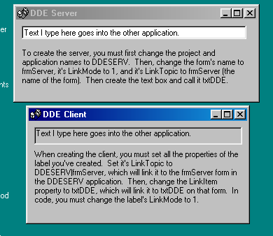

## Exchange data between two applications easily

### Description

Exchange data between two VB applications easily using Dynamic Data Exchange (DDE). In the example, text typed in the Server's text box will show on the Client's label. Instructions on doing this in your own applications is included on the forms.
 
### More Info
 

             |
---                |---
**Submitted On**   |2001-09-29 10:48:50
**By**             |[SGilmanVB](https://github.com/Planet-Source-Code/PSCIndex/blob/master/ByAuthor/sgilmanvb.md)
**Level**          |Beginner
**User Rating**    |4.5 (50 globes from 11 users)
**Compatibility**  |VB 6\.0
**Category**       |[DDE](https://github.com/Planet-Source-Code/PSCIndex/blob/master/ByCategory/dde__1-28.md)
**World**          |[Visual Basic](https://github.com/Planet-Source-Code/PSCIndex/blob/master/ByWorld/visual-basic.md)
**Archive File**   |[Exchange d271739292001\.zip](https://github.com/Planet-Source-Code/sgilmanvb-exchange-data-between-two-applications-easily__1-27646/archive/master.zip)

